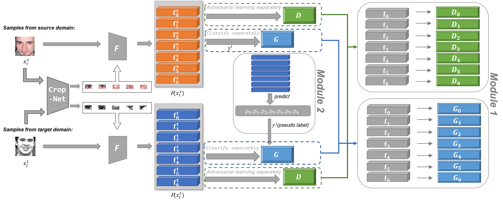

# Learning Consistent Global-Local Representation for Cross-Domain Facial Expression Recognition
Implementation of papers:
- [Learning Consistent Global-Local Representation for Cross-Domain Facial Expression Recognition](https://ieeexplore.ieee.org/abstract/document/9956069)  
  2022 26th International Conference on Pattern Recognition (ICPR)  
  Yuhao Xie, Yuefang Gao, Jiantao Lin, Tianshui Chen  
  

## Environment
Ubuntu 22.04.2 LTS, python 3.8.10, PyTorch 1.9.0
## Datasets
Application website： [SFEW 2.0](https://cs.anu.edu.au/few/AFEW.html), [FER2013](https://www.kaggle.com/c/challenges-in-representation-learning-facial-expression-recognition-challenge/data), [ExpW](http://mmlab.ie.cuhk.edu.hk/projects/socialrelation/index.html), [RAF](http://www.whdeng.cn/raf/model1.html).
## Trained Model ( Table Ⅰof paper )

| Backbone \ Target Datasets | FER2013    | ExpW       | SFEW       |
| -------------------------- | ---------- | ---------- | ---------- |
| ResNet-50                  | 1638244076 | 1638115309 | 1638294758 |
| MobileNet-v2               | 1648861856 | 1648861886 | 1648878815 |

The code for each configuration can be found in this [link](https://pan.baidu.com/s/1n7h15RW_-Tui_wSspExjVQ?pwd=d9ar ) using the file timestamp in the table above .

## Usage
```bash
cd code
bash TrainOnSourceDomain.sh     # First step
bash TransferToTargetDomain.sh  # Second step
```
## Citation
```bash
@INPROCEEDINGS{9956069,
  author={Xie, Yuhao and Gao, Yuefang and Lin, Jiantao and Chen, Tianshui},
  booktitle={2022 26th International Conference on Pattern Recognition (ICPR)}, 
  title={Learning Consistent Global-Local Representation for Cross-Domain Facial Expression Recognition}, 
  year={2022},
  volume={},
  number={},
  pages={2489-2495},
  doi={10.1109/ICPR56361.2022.9956069}}
```
## Contributors
For any questions, feel free to open an issue or contact us:
- <a href="mailto:yaoxie1001@gmail.com">yaoxie1001@gmail.com</a>
